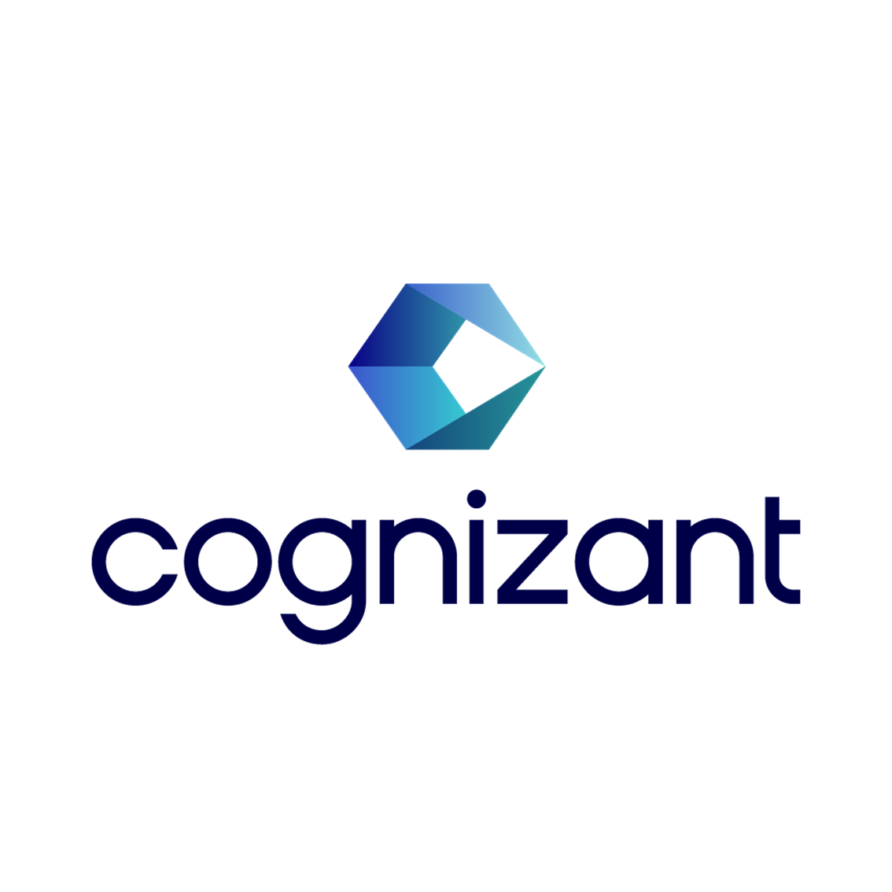

<div align="center">



# Cognizant Digital Nurture 4.0 / Deep Skilling Program

### Hands-on Solutions & Practice Repository


</div>

---

## Overview

This repository contains my solutions, hands-on exercises, notes, and project implementations completed as part of the **Cognizant Digital Nurture 4.0 Deep Skilling Program**.

The repository is organized week-wise and covers:

* Design Patterns & Principles
* Data Structures & Algorithms
* Advanced SQL
* NUnit & Moq
* Entity Framework Core
* ASP.NET Core Web API
* Microservices
* Angular

---

## Repository Structure

```text
DeepSkilling
│
├── Week1_DesignPatterns
│
├── Week2_DataStructuresAlgorithms
│
├── Week3_AdvancedSQL
│
├── Week4_NUnit_Moq
│
├── Week5_EntityFrameworkCore
│
├── Week6_ASPNETCore_WebAPI
│
├── Week7_Microservices
│
└── Week8_Angular
```

---

## Progress Tracker

### Week 1 - Design Patterns & Principles

* [x] Exercise 1 - Singleton Pattern
* [x] Exercise 2 - Factory Method Pattern
* [x] Exercise 3 - Builder Pattern

### Data Structures & Algorithms

* [x] Exercise 2 - E-commerce Search Function
* [x] Exercise 7 - Financial Forecasting

### Week 2 - Advanced SQL

* [x] Ranking & Window Functions
* [x] Stored Procedures
* [x] Functions
* [x] Indexes

### Week 3 - NUnit & Moq

* [ ] In Progress

### Week 4 - Entity Framework Core

* [ ] In Progress

### Week 5 - ASP.NET Core Web API

* [ ] In Progress

### Week 6 - Microservices

* [ ] In Progress

### Week 7 - GIT & Angular

* [ ] In Progress

---

## Technologies Used

* Java
* SQL Server
* C#
* .NET
* ASP.NET Core
* Entity Framework Core
* Angular
* Git & GitHub

---

## Notes

Each exercise folder contains:

* Source Code
* Output Screenshot
* README Documentation
* Supporting Notes (where applicable)

---

## Author

**Rawhan1819**

Cognizant Digital Nurture 4.0 – Deep Skilling Program

GitHub Repository maintained for learning, assessment tracking, and interview preparation.

```
```
